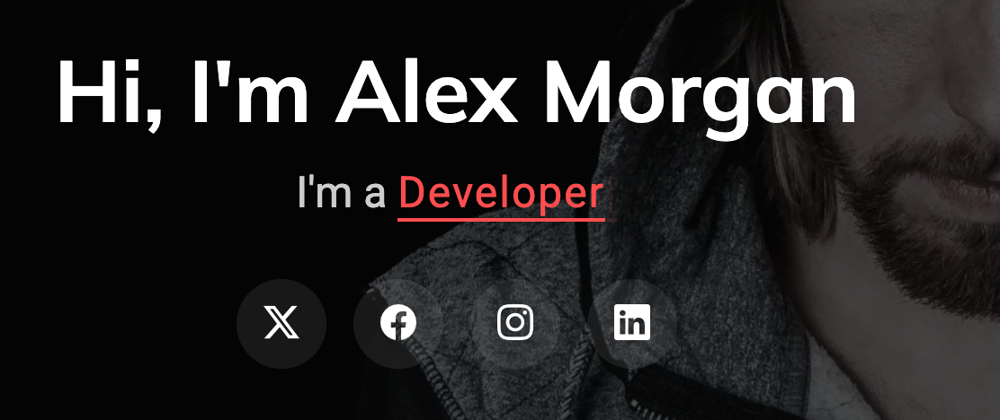
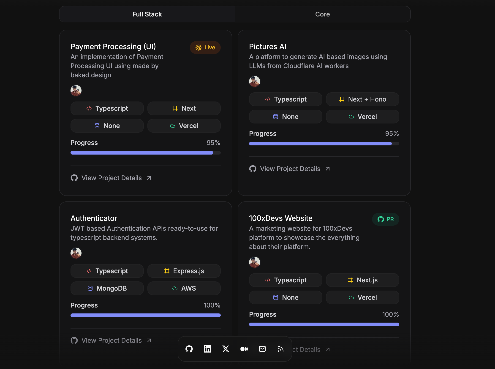

https://bootstrapmade.com/demo/Craftivo/ 
this is the theme of the template I want to use for my portfolio but I want to use my own content and images and customizations for diffrent components like hero section etc from other sources

check the effect of the name and title how it comes like a typed text. we need to make that

this is the description of how the hero section layout should look like. make your own version of it using my content and images
This is kinda something m wanting for my home page… the rest of the sections can be continuous scrolling
So the home section kinda summarises mu entire website with CTA’s to deep dive into other sections

this is how the project section should look like. make your own version of it using my content and images

Tabs: Home About Work Art Blog Contact 
rememebr this . 

now comes the important part. you will have a admin section for the user who's pprtfoio this is . this will nto be present anyehwer ein the main site. only can be accessed via /admin typed yourself and you will have a password which i will provide you later. 

this admin section will have the following features:
1. adding projects
2. editing projects
3. deleting projects
4. adding art
5. editing art
6. deleting art
7. adding blog
8. editing blog
9. deleting blog
10. adding about
11. editing about
12. deleting about
13. adding contact
14. editing contact
15. deleting contact

basilaly should be someewhere to edit the constants file which will have all the text and images and links and stuff. 

anywhere if you have doubts about the ui take inspiration from this https://www.tanayvaswani.com/ . onlu if its missing from the first theme i sent 